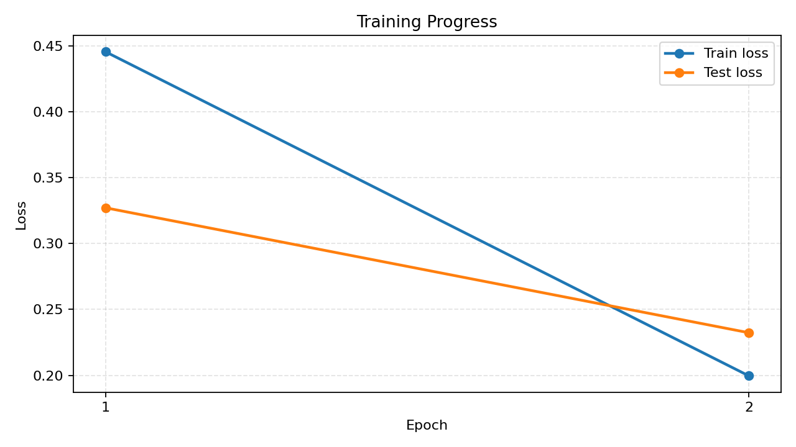
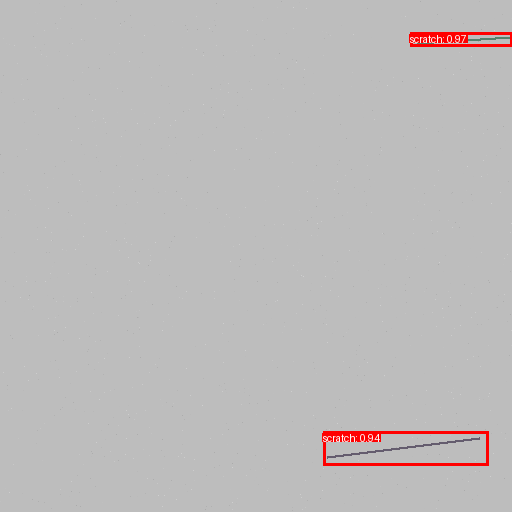
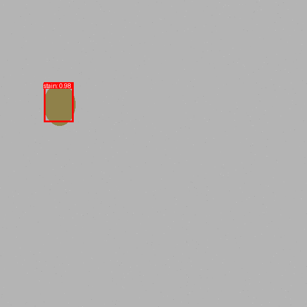

# DefectVision — Visual Defect Detection with PyTorch

DefectVision is a computer vision pet project for detecting visual defects on images using PyTorch and Faster R-CNN.

The project demonstrates a full object detection pipeline: synthetic dataset generation, COCO-style annotations, custom PyTorch Dataset, model training, evaluation, inference, visualization, Streamlit demo, FastAPI endpoint, and Docker support.

## Project Goal

The goal of this project is to build an end-to-end defect detection system that can localize different types of visual defects on images.

The current version supports three synthetic defect classes:

* `crack`
* `scratch`
* `stain`

The first version uses a synthetic dataset generated directly inside the project. This makes the repository fully reproducible without requiring an external dataset. The same pipeline can later be reused with a real industrial, road-damage, or surface-defect dataset in COCO format.

## Features

* Synthetic defect dataset generation
* COCO-style annotation format
* Custom `torch.utils.data.Dataset` for object detection
* Faster R-CNN fine-tuning with `torchvision`
* Training and validation pipeline
* Detection metrics: `mAP@0.5`, precision, recall
* Single-image inference
* Prediction visualization with bounding boxes and confidence scores
* Streamlit web demo
* FastAPI inference endpoint
* Docker support
* TorchScript / ONNX export script

## Tech Stack

* Python 3.10+
* PyTorch
* torchvision
* OpenCV
* NumPy
* Matplotlib
* Streamlit
* FastAPI
* Docker

## Repository Structure

```text
DefectVision/
├── configs/
│   └── faster_rcnn.yaml
├── src/
│   └── defect_detection/
│       ├── data/
│       ├── export/
│       ├── inference/
│       ├── models/
│       ├── serving/
│       ├── training/
│       └── utils/
├── tests/
│   └── test_dataset.py
├── Dockerfile
├── Makefile
├── pyproject.toml
├── requirements.txt
└── README.md
```

## Installation

Clone the repository:

```bash
git clone https://github.com/<your-username>/defect-vision.git
cd defect-vision
```

Create and activate a virtual environment:

```bash
python3 -m venv .venv
source .venv/bin/activate
```

Upgrade build tools:

```bash
python -m pip install --upgrade pip setuptools wheel
```

Install dependencies:

```bash
python -m pip install -r requirements.txt
python -m pip install -e .
```

## Dataset Generation

Generate a synthetic defect detection dataset:

```bash
python -m defect_detection.data.make_synthetic_dataset \
  --output data/synthetic \
  --train-size 120 \
  --val-size 30 \
  --test-size 30
```

Generated dataset structure:

```text
data/synthetic/
├── train/
│   ├── images/
│   └── annotations.json
├── val/
│   ├── images/
│   └── annotations.json
└── test/
    ├── images/
    └── annotations.json
```

## Training

Start training:

```bash
python -m defect_detection.training.engine --config configs/faster_rcnn.yaml
```

Training artifacts will be saved to:

```text
runs/defect_faster_rcnn/
├── best.pt
├── last.pt
├── metrics.jsonl
└── loss_curve.png
```

Each epoch writes `train_loss`, `test_loss`, detection metrics, learning rate, and epoch time to `metrics.jsonl`.
If `data.test_images` and `data.test_annotations` exist, `test_loss` is computed on the test split; otherwise the validation split is used as a fallback holdout split.
The loss comparison plot is updated automatically during training. It contains both `Train loss` and `Test loss` on the same graph. You can also rebuild it manually:

```bash
python -m defect_detection.training.plot_metrics \
  --metrics runs/defect_faster_rcnn/metrics.jsonl \
  --output assets/loss_curve.png
```

## Inference

Run prediction on a single image:

```bash
python -m defect_detection.inference.predict \
  --weights runs/defect_faster_rcnn/best.pt \
  --image data/synthetic/val/images/val_0000.png \
  --output outputs/prediction.png \
  --score-threshold 0.4
```

The output image will contain detected defects with bounding boxes, class names, and confidence scores.

## Streamlit Demo

Run the Streamlit web application:

```bash
streamlit run src/defect_detection/serving/streamlit_app.py -- \
  --weights runs/defect_faster_rcnn/best.pt
```

The demo allows the user to upload an image and receive visual defect detection results.

## FastAPI Demo

Start the API server:

```bash
uvicorn defect_detection.serving.api:app --reload --host 0.0.0.0 --port 8000
```

Open the generated API documentation:

```text
Swagger UI:  http://localhost:8000/docs
ReDoc:       http://localhost:8000/redoc
OpenAPI:     http://localhost:8000/openapi.json
```

The root endpoint also returns the documentation links:

```bash
curl http://localhost:8000/
```

Send an image to the API:

```bash
curl -X POST "http://localhost:8000/predict" \
  -F "file=@data/synthetic/val/images/val_0000.png"
```

You can override the default confidence threshold per request:

```bash
curl -X POST "http://localhost:8000/predict?score_threshold=0.5" \
  -F "file=@data/synthetic/val/images/val_0000.png"
```

## Configuration

The main training configuration is located at:

```text
configs/faster_rcnn.yaml
```

Example configuration:

```yaml
seed: 42
device: auto

num_classes: 4
class_names:
  - "__background__"
  - "crack"
  - "scratch"
  - "stain"

model:
  name: fasterrcnn_resnet50_fpn
  pretrained: true

train:
  epochs: 5
  batch_size: 2
  lr: 0.005

data:
  train_images: data/synthetic/train/images
  train_annotations: data/synthetic/train/annotations.json
  val_images: data/synthetic/val/images
  val_annotations: data/synthetic/val/annotations.json
  test_images: data/synthetic/test/images
  test_annotations: data/synthetic/test/annotations.json
```

`num_classes` includes the background class.
For three defect classes, the value is `4`.

## Results

The model was trained for 5 epochs on the generated synthetic dataset and evaluated on the synthetic validation split.
The validation set contains 30 images. Metrics are reported at IoU `0.5`; evaluation uses the configured score threshold `0.35`.

| Model                     | Checkpoint | Epoch | Dataset               | mAP@0.5 | Precision | Recall |
| ------------------------- | ---------- | ----: | --------------------- | ------: | --------: | -----: |
| Faster R-CNN ResNet50 FPN | `last.pt`  |     5 | Synthetic defects val |  0.9394 |    0.9550 | 0.9815 |
| Faster R-CNN ResNet50 FPN | `best.pt`  |     2 | Synthetic defects val |  0.9394 |    0.9292 | 0.9722 |

Final validation counts for `last.pt`:

| TP | FP | FN |
| -: | -: | -: |
| 106 | 5 | 2 |

Loss tracking:

* new training runs save both `train_loss` and `test_loss` to `runs/defect_faster_rcnn/metrics.jsonl`;
* `runs/defect_faster_rcnn/loss_curve.png` contains both curves on one comparison plot;
* the historical run shown below was trained before `test_loss` logging was added, so its stored `metrics.jsonl` contains only `train_loss`.



Prediction examples generated with `best.pt` and score threshold `0.4`:





Result artifacts:

```text
assets/prediction_1.png
assets/prediction_2.png
assets/loss_curve.png
runs/defect_faster_rcnn/loss_curve.png
runs/defect_faster_rcnn/best.pt
runs/defect_faster_rcnn/last.pt
runs/defect_faster_rcnn/metrics.jsonl
```

## Using a Real Dataset

To use a real dataset, prepare annotations in COCO format.

Example COCO-style annotation structure:

```json
{
  "images": [
    {
      "id": 1,
      "file_name": "image_001.jpg",
      "width": 640,
      "height": 480
    }
  ],
  "annotations": [
    {
      "id": 1,
      "image_id": 1,
      "category_id": 1,
      "bbox": [120, 80, 200, 60],
      "area": 12000,
      "iscrowd": 0
    }
  ],
  "categories": [
    {
      "id": 1,
      "name": "crack"
    }
  ]
}
```

Then update dataset paths in `configs/faster_rcnn.yaml`:

```yaml
data:
  train_images: data/my_dataset/train/images
  train_annotations: data/my_dataset/train/annotations.json
  val_images: data/my_dataset/val/images
  val_annotations: data/my_dataset/val/annotations.json
  test_images: data/my_dataset/test/images
  test_annotations: data/my_dataset/test/annotations.json
```

## Model Export

The project includes a model export script:

```bash
python -m defect_detection.export.export_model \
  --weights runs/defect_faster_rcnn/best.pt \
  --output exports/model.pt
```

The export script can be extended for ONNX export and optimized inference.

## Docker

Build the Docker image:

```bash
docker build -t defect-vision .
```

Run the container:

```bash
docker run --rm -p 8000:8000 defect-vision
```

## Makefile Commands

The project includes a `Makefile` with common commands:

```bash
make install
make data
make train
make plot-loss
make predict
make streamlit
make api
```

## Current Status

The project currently includes:

* synthetic defect dataset generation;
* COCO-style dataset loading;
* Faster R-CNN training pipeline;
* model evaluation;
* single-image inference;
* prediction visualization;
* Streamlit demo;
* FastAPI inference endpoint;
* Docker support.

## Future Improvements

Possible next steps for this project:

* train the model on a real defect detection dataset;
* add experiment tracking with MLflow or Weights & Biases;
* compare Faster R-CNN with other detection models;
* add ONNX Runtime inference benchmark;
* add a Mask R-CNN version for defect segmentation;
* add CI checks with GitHub Actions.

## Troubleshooting

### `python: command not found`

On macOS, use `python3` when creating the virtual environment:

```bash
python3 -m venv .venv
source .venv/bin/activate
```

After activating the virtual environment, the `python` command should work.

### SSL certificate error on macOS

If training fails while downloading pretrained PyTorch weights with an SSL certificate error, run:

```bash
open "/Applications/Python 3.10/Install Certificates.command"
```

Then activate the environment again and restart training:

```bash
source .venv/bin/activate
python -m defect_detection.training.engine --config configs/faster_rcnn.yaml
```

If the file is located in another Python version folder, find it with:

```bash
find /Applications -name "Install Certificates.command"
```

## License

This project is intended for educational and portfolio purposes.
